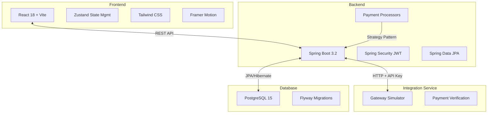

# PayFlow - Digital Payment & E-Wallet Platform

A production-grade, full-stack fintech application built with Java Spring Boot and React. PayFlow is a mobile-first digital payment and e-wallet platform featuring secure transactions, bill payments, QR code payments, and comprehensive admin analytics.

## Architecture Diagram



## Tech Stack

### Backend
- **Java 17** with **Spring Boot 3.2.x**
- **Spring Security 6** with JWT (access: 15min, refresh: 7 days)
- **Spring Data JPA** + Hibernate ORM
- **PostgreSQL 15** with **Flyway** migrations
- **MapStruct** for DTO mapping
- **Lombok** for boilerplate reduction
- **Caffeine Cache** for wallet balance caching
- **Maven** build system

### Integration Microservice
- Separate Spring Boot app simulating external payment gateway
- Simulates realistic 5% failure rate
- 200-800ms artificial network latency

### Frontend
- **React 18** with **Vite**
- **Tailwind CSS** for styling
- **Zustand** for state management
- **React Hook Form + Zod** for validation
- **Framer Motion** for animations
- **Recharts** for admin analytics
- **QR Code libraries** for payments

## OOP Design Patterns

### 1. Encapsulation
```java
// Wallet entity - balance only modifiable via domain methods
@Entity
public class Wallet extends BaseEntity {
    private BigDecimal balance; // No setter
    
    public void credit(BigDecimal amount) { /* validation + credit */ }
    public void debit(BigDecimal amount) { /* validation + debit */ }
}
```

### 2. Inheritance
```java
@MappedSuperclass
public abstract class BaseEntity {
    private UUID id;
    private LocalDateTime createdAt;
    private LocalDateTime updatedAt;
}

@Entity
public class User extends BaseEntity { /* inherits audit fields */ }
```

### 3. Polymorphism
```java
// PaymentProcessor interface with multiple implementations
public interface PaymentProcessor {
    PaymentResult process(PaymentRequest request);
}

@Component
public class WalletTransferProcessor implements PaymentProcessor { }
@Component
public class BillPaymentProcessor implements PaymentProcessor { }
@Component
public class TopUpProcessor implements PaymentProcessor { }
```

### 4. Abstraction
```java
// Repository interfaces hide implementation
public interface UserRepository extends JpaRepository<User, UUID> {
    Optional<User> findByUsername(String username);
}

// Service interfaces define contracts
public interface WalletService {
    WalletResponse getWalletByUserId(UUID userId);
}
```

## Security Features

- **JWT Authentication**: Access tokens (15 min), refresh tokens (7 days with rotation)
- **BCrypt Password Hashing**: Strength 12
- **Transaction PIN**: Separate 6-digit PIN for payments
- **Rate Limiting**: 5 login attempts per minute per IP
- **CORS Configuration**: Restricted to frontend origin
- **Security Headers**: X-Content-Type-Options, X-Frame-Options, X-XSS-Protection
- **Input Validation**: Bean Validation on all DTOs
- **SQL Injection Prevention**: JPA named parameters only

## Prerequisites

- Java 17+
- Node.js 18+
- Docker & Docker Compose
- Maven 3.8+

## Quick Start

### 1. Clone and Navigate
```bash
git clone <repository-url>
cd PayFlow
```

### 2. Environment Setup
```bash
# Copy environment templates
cp backend/.env.example backend/.env
cp frontend/.env.example frontend/.env

# Edit with your values
```

### 3. Start with Docker Compose
```bash
docker-compose up -d
```

This starts:
- PostgreSQL database
- Backend API (port 8080)
- Integration Service (port 8081)
- Frontend (port 3000)

### 4. Manual Development Setup

**Backend:**
```bash
cd backend
mvn clean install
mvn spring-boot:run
```

**Integration Service:**
```bash
cd integration-service
mvn spring-boot:run
```

**Frontend:**
```bash
cd frontend
npm install
npm run dev
```

## API Documentation

### Authentication Endpoints
```
POST /api/auth/register    # Register new user
POST /api/auth/login       # Login
POST /api/auth/refresh     # Refresh tokens
POST /api/auth/logout      # Logout
POST /api/auth/setup-pin   # Set transaction PIN
```

### Wallet Endpoints
```
GET  /api/wallet/balance     # Get balance
GET  /api/wallet/qr-code    # Generate QR code
```

### Transaction Endpoints
```
POST /api/transactions/topup       # Top up wallet
POST /api/transactions/transfer   # Transfer to user
POST /api/transactions/pay-bill   # Pay bill
POST /api/transactions/scan-qr    # QR payment
GET  /api/transactions            # Transaction history
```

### Admin Endpoints (ROLE_ADMIN required)
```
GET /api/admin/users              # List users
GET /api/admin/transactions       # List all transactions
GET /api/admin/analytics/summary  # Dashboard stats
GET /api/admin/analytics/daily-volume  # Chart data
```

All responses use the envelope format:
```json
{
  "status": "success|error",
  "data": { ... },
  "message": "...",
  "timestamp": "2024-01-15T10:30:00Z"
}
```

## Testing

### Run Unit Tests
```bash
cd backend
mvn test
```

### Run Integration Tests
```bash
cd backend
mvn test -Dtest=*IntegrationTest
```

### Test Coverage
- **WalletServiceImplTest**: Credit/debit, balance checks
- **AuthServiceImplTest**: Registration, login, token rotation
- **TransactionServiceImplTest**: Transfers, bill payments
- **PaymentProcessorFactoryTest**: Processor selection
- **Custom Validation Tests**: @ValidPassword, @ValidAmount

## Environment Variables

### Backend (.env)
```
DB_URL=jdbc:postgresql://postgres:5432/payflow
DB_USERNAME=payflow
DB_PASSWORD=secret
JWT_SECRET=your-256-bit-secret-here
JWT_ACCESS_EXPIRY_MS=900000
JWT_REFRESH_EXPIRY_MS=604800000
INTERNAL_API_KEY=internal-secret-key
INTEGRATION_SERVICE_URL=http://integration-service:8081
```

### Frontend (.env)
```
VITE_API_URL=http://localhost:8080/api
```

## Default Credentials

**Admin User:**
- Username: `admin`
- Password: `Admin@123`

*(Note: Seeded via database migration in production environments)*

## Project Structure

```
PayFlow/
├── backend/                    # Spring Boot main application
│   ├── src/main/java/com/payflow/
│   │   ├── config/            # Security, Cache, CORS config
│   │   ├── controller/        # REST controllers
│   │   ├── service/           # Business logic (interfaces + impl)
│   │   ├── entity/            # JPA entities (with OOP encapsulation)
│   │   ├── dto/               # Request/response DTOs
│   │   ├── repository/        # JPA repositories
│   │   ├── security/          # JWT, filters, UserDetailsService
│   │   ├── payment/           # PaymentProcessor interface + implementations
│   │   ├── gateway/           # IntegrationGateway
│   │   ├── notification/      # NotificationSender
│   │   ├── validation/        # Custom validators
│   │   ├── exception/         # Custom exceptions + handler
│   │   └── response/          # BaseResponse sealed class
│   └── src/main/resources/
│       └── db/migration/      # Flyway migrations V1-V7
│
├── integration-service/       # Gateway simulator
│   └── src/main/java/com/integration/
│       └── controller/GatewayController.java
│
├── frontend/                  # React application
│   ├── src/
│   │   ├── components/ui/     # Reusable UI components
│   │   ├── pages/             # Screen components
│   │   ├── stores/            # Zustand stores
│   │   └── services/          # API & formatters
│   └── package.json
│
├── docs/                      # Documentation
│   ├── integration-protocol.md
│   └── qa-test-plan.md
│
├── docker-compose.yml         # Full stack orchestration
└── README.md
```

## Contributing

1. Fork the repository
2. Create a feature branch
3. Write tests for new functionality
4. Ensure all tests pass
5. Submit a pull request

## License

MIT License - See LICENSE file for details

## Support

For issues and questions:
- Open a GitHub issue
- Contact: support@payflow.example.com

---

**Built with ❤️ for the fintech industry**
